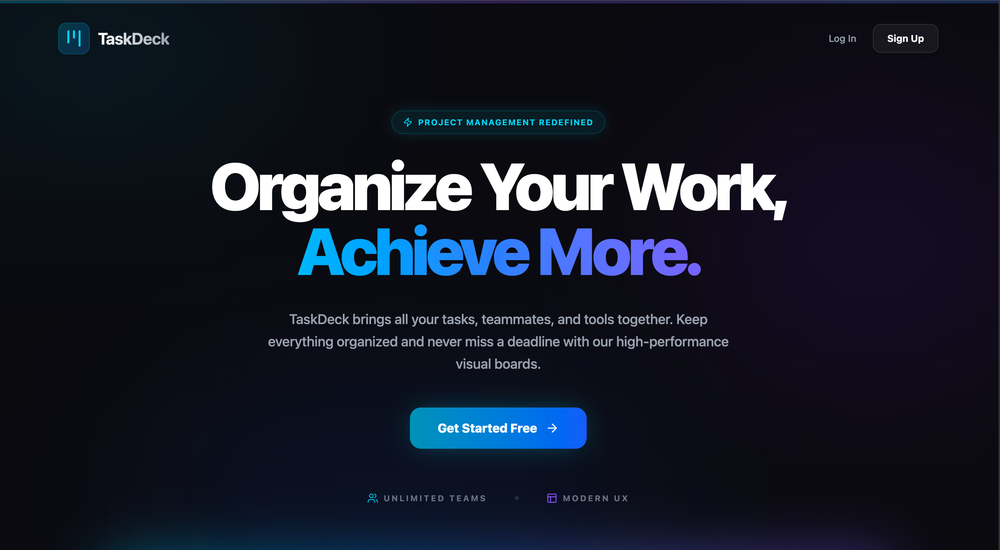

# TaskDeck

A full-stack task management application built on a three-tier **Boards → Lists → Tasks** hierarchy, with multi-level role-based access control (RBAC) and Google OAuth 2.0 authentication.

TaskDeck lets teams organize work into boards, break boards into lists, and track individual tasks — while enforcing fine-grained permissions so users only see and modify what their role allows.

<!-- Replace with a real screenshot or demo GIF — this is the single highest-impact thing you can add -->


🔗 **Live demo:** [taskdeck.vercel.app](https://taskdeck.vercel.app) &nbsp;·&nbsp; 💻 **Code:** [github.com/kushal-24/taskdeck](https://github.com/kushal-24/taskdeck)

---

## Features

- **Three-tier hierarchy** — organize work as Boards → Lists → Tasks, mirroring how teams actually plan.
- **Multi-level RBAC** — scoped authorization middleware enforces permission checks on every protected API route, preventing privilege escalation across the hierarchy.
- **Role-aware dashboard** — boards render conditionally based on ownership and membership status, evaluated server-side on every request so users never receive data they aren't authorized to see.
- **Google OAuth 2.0** — secure sign-in with JWT-based session handling.
- **RESTful API** — clean, resource-oriented endpoints for boards, lists, and tasks.

---

## Tech Stack

| Layer | Technology |
|---|---|
| Frontend | React.js, Tailwind CSS |
| Backend | Node.js, Express.js |
| Database | MongoDB (Mongoose ODM) |
| Auth | Google OAuth 2.0, JWT |
| Access Control | Role-Based Access Control (RBAC) |

---

## Architecture

TaskDeck uses a layered permission model. Each resource in the hierarchy carries ownership and membership metadata, and a shared authorization middleware validates the requesting user's role against the specific resource before any protected handler runs.

```
Client (React)
      │  JWT in Authorization header
      ▼
Express API
      │
      ▼
Auth Middleware ──► verify JWT ──► resolve user
      │
      ▼
RBAC Middleware ──► check role vs. resource (Board / List / Task)
      │
      ▼
Route Handler ──► MongoDB (Mongoose)
```

Permissions are checked at the resource level, not just the route level, so a user with access to one board cannot reach lists or tasks belonging to another.

---

## Getting Started

### Prerequisites

- Node.js (v18 or later)
- A MongoDB instance (local or MongoDB Atlas)
- Google OAuth 2.0 credentials ([Google Cloud Console](https://console.cloud.google.com/))

### Installation

```bash
# Clone the repository
git clone https://github.com/kushal-24/taskdeck.git
cd taskdeck

# Install backend dependencies
cd server
npm install

# Install frontend dependencies
cd ../client
npm install
```

### Environment Variables

Create a `.env` file in the `server` directory:

```env
PORT=5000
MONGO_URI=your_mongodb_connection_string
JWT_SECRET=your_jwt_secret
GOOGLE_CLIENT_ID=your_google_client_id
GOOGLE_CLIENT_SECRET=your_google_client_secret
CLIENT_URL=http://localhost:5173
```

And a `.env` file in the `client` directory:

```env
VITE_API_URL=http://localhost:5000
VITE_GOOGLE_CLIENT_ID=your_google_client_id
```

### Running Locally

```bash
# Start the backend (from /server)
npm run dev

# In a separate terminal, start the frontend (from /client)
npm run dev
```

The app will be available at `http://localhost:5173`.

---

## API Overview

| Method | Endpoint | Description |
|---|---|---|
| `GET` | `/api/boards` | List boards the user can access |
| `POST` | `/api/boards` | Create a new board |
| `GET` | `/api/boards/:id/lists` | Get lists within a board |
| `POST` | `/api/lists` | Create a list |
| `POST` | `/api/tasks` | Create a task |
| `PATCH` | `/api/tasks/:id` | Update a task |
| `DELETE` | `/api/tasks/:id` | Delete a task |

<!-- Adjust these to match your actual routes -->

---

## Roadmap

- [ ] Drag-and-drop task reordering
- [ ] Activity log / audit trail
- [ ] Task due dates and reminders
- [ ] Member addition removal permissions
- [ ] Comment - review system for tasks
- [ ] Multi - levelRBAC


<!-- Trim or expand to reflect what you actually plan to build -->

---

## License

Distributed under the MIT License. See `LICENSE` for details.

---

## Author

**Kushal Amit Phadnis** — [GitHub](https://github.com/kushal-24) · [LinkedIn](https://www.linkedin.com/in/kushal-phadnis-04456b333/)
